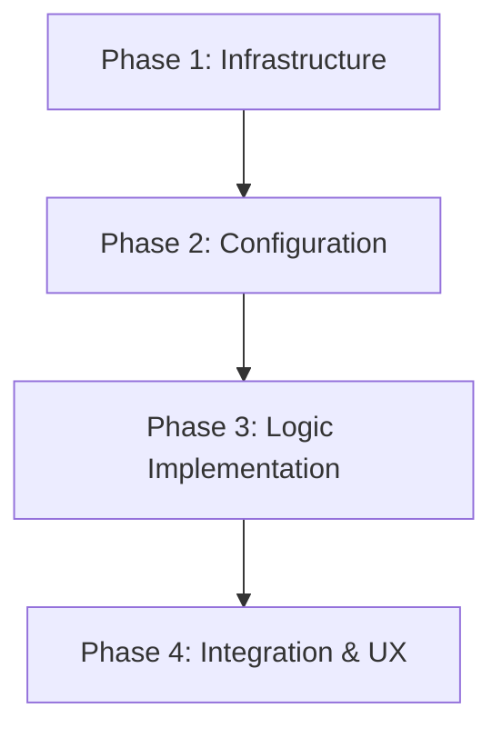

# Implementation Plan: Tailscale Serve & Seamless Mobile Onboarding

This plan implements a robust remote access setup for OpenClaw using Tailscale Serve (HTTPS) and an interactive auto-approval onboarding flow.

## Plan Overview
- **Total Phases**: 4
- **Agents Involved**: `devops_engineer`, `coder`, `tester`
- **Estimated Effort**: High (requires socket integration and polling logic)

## Dependency Graph

## Execution Strategy Table
| Stage | Phases | Agent | Mode |
|-------|--------|-------|------|
| 1 | Phase 1 | devops_engineer | Sequential |
| 2 | Phase 2 | coder | Sequential |
| 3 | Phase 3 | coder | Sequential |
| 4 | Phase 4 | coder, tester | Sequential |

## Phase Details

### Phase 1: Infrastructure (Docker & Shell)
- **Objective**: Prepare the environment for Tailscale Serve integration.
- **Agent**: `devops_engineer`
- **Files to Modify**:
    - `docker-compose.yml`: Add volume mount for Tailscale socket.
    - `docker-install.sh`: Add MagicDNS check and link-prompting.
- **Implementation Details**:
    - Map `/var/run/tailscale/tailscaled.sock` to the same path in the container.
    - Use `tailscale status --json` to verify MagicDNS. If disabled, print Tailscale admin URL and wait for user.
- **Validation**:
    - `docker compose config` (syntax check).
    - `ls -S /var/run/tailscale/tailscaled.sock` inside container.

### Phase 2: Configuration (The "Golden Rule")
- **Objective**: Generate a schema-compliant `openclaw.json` for Tailscale Serve.
- **Agent**: `coder`
- **Files to Modify**:
    - `scripts/setup/steps/01_config.js`: Set `mode: "local"`, `bind: "loopback"`, `tailscale.mode: "serve"`.
- **Implementation Details**:
    - Remove all invalid keys (`secret`, `sessionKey`).
    - Ensure `allowedOrigins: ["*"]` is set when Tailscale is enabled.
- **Validation**:
    - `cat .docker-config/openclaw/openclaw.json` (visual check).
    - `docker exec openclaw-gemini-adapter openclaw config validate`.

### Phase 3: Logic Implementation (Auto-Pairing & Onboarding)
- **Objective**: Implement the automatic device approval and onboarding scripts.
- **Agent**: `coder`
- **Files to Create**:
    - `scripts/setup/steps/07_autopair.js`: Background polling and approval logic.
- **Files to Modify**:
    - `scripts/setup/steps/06_mobile.js`: HTTPS reachability check and QR update.
    - `docker-setup.js`: Add step 07 to the orchestrator.
- **Implementation Details**:
    - `07_autopair.js`: Poll `openclaw devices list --json` every 2s. Approve any `pending` device.
    - `06_mobile.js`: Use `fetch` with a timeout/retry to wait for `https://${TAILSCALE_HOSTNAME}` to return 200 OK.
- **Validation**:
    - Mock `openclaw devices list` output and verify auto-approval.

### Phase 4: Integration & UX Refinement
- **Objective**: Final polish and end-to-end verification.
- **Agent**: `coder`, `tester`
- **Implementation Details**:
    - Update `docker-install.sh` wait logic to use the HTTPS URL for readiness check.
- **Validation**:
    - Run `./docker-install.sh` from scratch.
    - Verify that QR codes only appear after HTTPS is live.

## Cost Estimation
| Phase | Agent | Model | Est. Input | Est. Output | Est. Cost |
|-------|-------|-------|-----------|------------|----------|
| 1 | devops_engineer | flash | 1500 | 500 | $0.004 |
| 2 | coder | flash | 1500 | 400 | $0.003 |
| 3 | coder | flash | 2000 | 1000 | $0.006 |
| 4 | tester | flash | 1500 | 500 | $0.004 |
| **Total** | | | **6500** | **2400** | **$0.017** |

## Risk Classification
- **Phase 1**: MEDIUM (Socket path variations).
- **Phase 3**: HIGH (Concurrent process management in Node setup).

## Execution Profile
- Total phases: 4
- Parallelizable phases: 0 (Strict dependency on infrastructure)
- Sequential-only phases: 4
- Estimated sequential wall time: 20-30 mins
