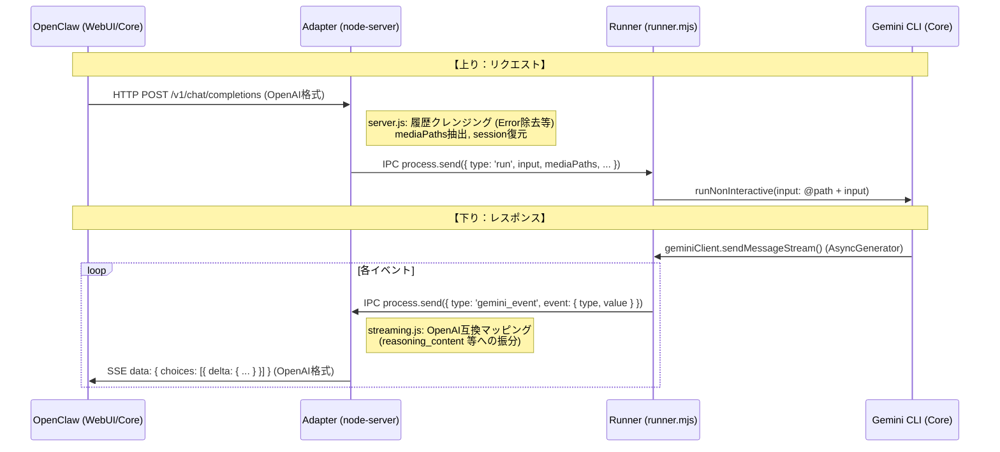

# 調査レポート：データフローとメッセージ仕様の全容 (Fact Finding Report)

## 1. 調査目的
Gemini CLI, Adapter, OpenClaw の 3 層におけるデータの流れ、および各層で送受信されるメッセージタイプ（スキーマ）の真実を明らかにする。

---

## 2. データの流れ (High-Level Data Flow)

---

## 3. 各層のメッセージタイプ一覧 (Message Spec)

### 3-1. Gemini CLI → Adapter (IPCイベント: `gemini_event`)
`runner.mjs` でラップされた `sendMessageStream` が送出する `event` オブジェクトの `type` 一覧：

| タイプ (`type`) | 値 (`value`) の構造 / 内容 |
|---|---|
| `content` | 最終回答のテキストチャンク (string) |
| `thought` | 思考プロセス。`{ subject, description }` または文字列。 |
| `tool_call_request` | ツール実行要請。`{ name, args, call_id }` |
| `tool_result` | ツール実行結果。`{ name, result, status }` |
| `error` | 実行時のエラー情報。 |
| `finished` | ストリームの正常終了。 |
| `loop_detected` | エージェントの無限ループ検知。 |
| `agent_execution_stopped` | 中断理由など。 |

### 3-2. OpenClaw → Adapter (OpenAI 格式: `messages`)
OpenClaw がアダプターに送り、アダプターが次ターンの Gemini CLI 入力のために解釈する形式：

| ロール (`role`) | 内容 (`content`) の役割 |
|---|---|
| `system` | システムプロンプト。アダプターが `prepareGeminiEnv` で `system.md` として書き出す。 |
| `user` | ユーザー入力。テキスト、または画像オブジェクト (`image_url`)。 |
| `assistant` | **【要注意】** モデルの回答。ここに `thought` や `tool_call` のログが文脈として含まれる場合がある。 |

### 3-3. Adapter → OpenClaw (OpenAI 格式: `delta`)
アダプターが OpenClaw の UI を制御するために送出するストリーム断片：

| フィールド | アダプターによるマッピング元 |
|---|---|
| `content` | Gemini の `content` イベント。 |
| `reasoning_content` | Gemini の `thought` および `tool_call_request`（現状の装飾あり形式）。 |
| `tool_calls` | (SSoT 5.1以前) 削除済み。現在は `reasoning_content` に統合。 |

---

## 4. Adapter 側の双方向加工ロジック (Mapping Logic)

### 4-1. 下り方向：Gemini イベントの OpenAI 変換
`src/streaming.js` 内の `runner.on('message')` で実行：
1.  **`content`** -> `delta.content` (そのまま)
2.  **`thought`** -> `delta.reasoning_content` (Markdown 太字装飾など)
3.  **`tool_call_request`** -> `delta.reasoning_content` (⚙️絵文字 + JSONブロック装飾) **← 履歴汚染の元**

### 4-2. 上り方向：履歴のクレンジング (Total Cleansing)
`src/server.js` 内で Gemini CLI プロセスを起動する直前に実行：
1.  **エラー除去**: `⚠️ [Gemini API Error]` を含む行を削除。
2.  **装飾の逆パース (未踏)**: 現在、`⚙️` 等の装飾を消去する正規表現が不足しているため、履歴リクエストに含まれたツールログがそのまま Gemini CLI の「ユーザーからの新しい指示」のような顔をしてコンテキストに混入し、LLM を混乱させている。

---
## 結論
本調査で定義されたデータフローに基づき、**SSoT 6.0（ツールマーカー ID 方式）**が設計・実装されました。これにより、OpenClaw と Gemini CLI のメッセージ仕様の不整合が解消されました。

- **対応ステータス**: 完了 (Completed)
- **解決策の詳細**: `035_ssot_6_architecture_design.md` および `src/streaming.js` の新実装を参照。
